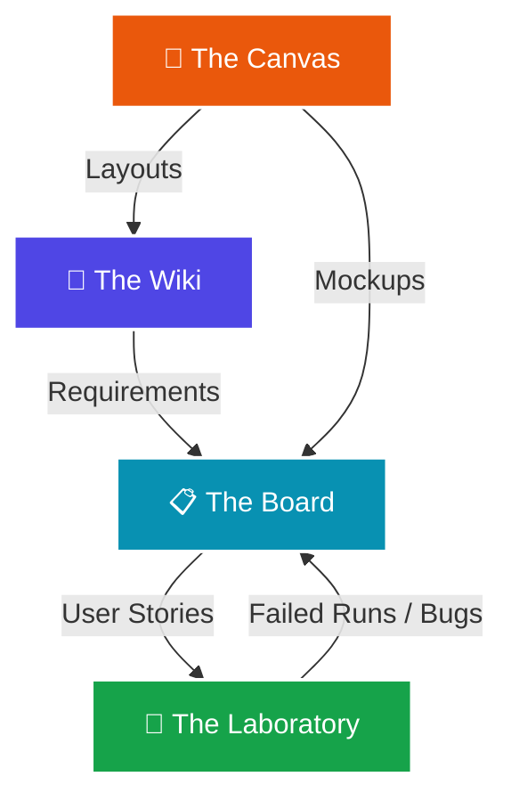

# Monolith 🌌

**Monolith** is an AI-driven, unified software development suite designed specifically for solo developers and indie hackers. It streamlines product management, system design, documentation, and quality assurance into a single, cohesive, local-first application. 

By consolidating the core capabilities of **The Wiki, The Canvas, The Board, and The Laboratory** into simplified, interconnected workflows, Monolith acts as your AI co-pilot, letting you build, document, track, and test your applications without the overhead of heavy enterprise tools.

---

## 🛠️ The Four Pillars of Monolith

Monolith brings together four key pillars of software development, designed to feed into each other seamlessly:



### 1. 📝 The Wiki
*Structured knowledge and requirements gathering.*
* **Manual or AI-Generated**: Write documents, product requirement docs (PRDs), or technical specifications from scratch, or prompt the AI to generate drafts for you.
* **Review & Approve**: The AI generates documentation drafts which you can edit, reject, or approve with one click.
* **Dynamic Linking**: Tag tasks or test scenarios directly inside your documents.

### 2. 🎨 The Canvas (Optional)
*Interactive UI/UX design and whiteboard layouts.*
* **Simplified Elements**: Draw layouts, mockups, flowcharts, or wireframes with a clean, vector-based canvas.
* **AI-Guided UI Generator**: Describe a component or page to the AI, and have it auto-generate layout wireframes, color schemes, or component structures directly on the Canvas.
* **Export & Link**: Reference design frames inside Board tasks or Wiki documentation pages.

### 3. 📋 The Board
*Task, bug, and E2E test task tracking.*
* **Project Dashboard**: Organize your work with simplified Kanban boards, lists, and backlogs.
* **Smart Ticket Generation**: The AI analyzes your Wiki documents / PRDs and automatically breaks them down into task, bug, or epic tickets.
* **E2E Integration**: Create E2E test tasks that map directly to functional requirements and code updates.

### 4. 🧪 The Laboratory
*Test scenario design and test run execution.*
* **Requirement-to-Test Mapping**: Map test cases directly back to Board tickets and Wiki documents to guarantee test coverage.
* **AI Scenario Generator**: Tell the AI what a feature does, and it will generate detailed step-by-step manual and E2E test scenarios.
* **Execution Runner**: Track manual test runs, log passes/fails, and automatically open a Board bug ticket if a test scenario fails.

---

## 🤖 AI-Native Orchestration

What makes Monolith unique is its **fully integrated AI context engine**. In traditional workflows, a developer must manually copy requirements from documentation to write tasks, then read those tasks to write test cases, and finally write code. 

In Monolith:
1. **Explain your feature idea** to The Wiki AI. It drafts a PRD.
2. **Accept the PRD**, and the AI suggests a list of tasks and E2E test targets on The Board.
3. **Approve the tasks**, and the Test AI populates step-by-step test scenarios in The Laboratory.
4. **Link the tickets** to your local git commits or code references for end-to-end traceability.

---

## 🚀 Tech Stack & Architecture

Monolith is built using modern, fast, and light web technologies optimized for local execution:

* **Framework**: [Next.js](https://nextjs.org/) (App Router, React 19, TypeScript)
* **Styling**: [Tailwind CSS v4](https://tailwindcss.com/)
* **Database**: SQLite (local database file)
* **ORM**: Prisma ORM for schema modeling and type-safe database queries
* **Visuals / The Canvas**: SVGs and HTML5 Canvas APIs for The Canvas visual components.
* **AI Core**: Local SDK configuration connecting to LLM providers (Google Gemini / Antigravity).

---

## 🏃 Getting Started

### Prerequisites
* **Node.js** (v20+ recommended)
* **npm / pnpm / yarn**

### Installation

1. Clone the repository:
   ```bash
   git clone https://github.com/your-username/monolith.git
   cd monolith
   ```

2. Install dependencies:
   ```bash
   npm install
   ```

3. Configure environment variables (e.g. LLM API keys):
   ```bash
   cp .env.example .env.local
   ```

4. Run the development server:
   ```bash
   npm run dev
   ```

5. Open [http://localhost:3000](http://localhost:3000) in your web browser.

---

## ⚖️ Project Status

Monolith is currently in active development. Check out [DEVLOG.md](file:///home/grimmage/Projects/monolith/DEVLOG.md) to see completed milestones, what is currently in progress, and the roadmap ahead.
